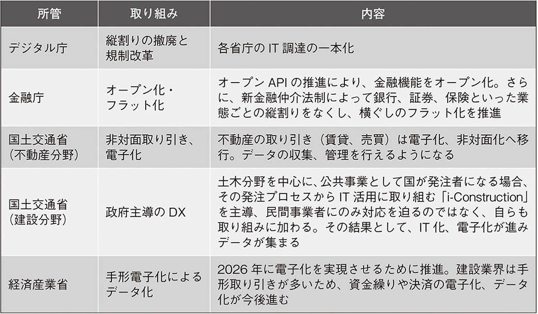

# プロップテックの衝撃

## 桜井駿

---

## PropTech とは何か

---

- ConTech、CRETech を含めた PropTech
- オンライン → マーケットプレイス → トランザクション

---

## PropTech のサービス

---

- アンバンドリング、ワンストップ
- 不動産業界は関与するプレーヤー、ステークホルダーが多い
- 空き家は 1998→2018 で 1.5 倍
- プレーヤー型とサポーター型
- 「ディスラプト」は結果論
  - 既存のプレーヤーと協業・連携することの方が多い
  - 既存のプレーヤーが既得権益の保護を優先した場合に結果として破壊的になる

---

### メモ

- シェアハウス SaaS ってニーズがあるのだろうか？

---

## PropTech を支えるテクノロジー

---

### AI

- 価格推定・査定
- 投資用不動産の将来予測
- 業務支援、リスク分析

---

### VR

- 内見

### IoT

- スマートロック

---

### ロボティクス

- 清掃・建物メンテナンス

### ブロックチェーン

- デジタル証券（STO）

---

### MaaS

- エリア価値の向上

### CaaS（City as a Service）

- 都市情報のアップデート
- 情報の一括管理（ただし個人情報の利用に関して課題あり）

---

### eKYC

オンラインで完結する自然人の本人特定事項の確認方法の追加

- 本人確認書類の画像＋本人の要望の画像送信
- IC チップ情報＋顧客の容貌の画像送信
- 銀行等への照会
- 顧客名義口座への少額振込

---

### UI/UX

- リアルとオンライン双方を意識したオペレーション

---

### SPAC（Special Purpose Acquisition Company）

- 上場時点では自ら事業は行わないペーパーカンパニー
- 上場後に株式市場からも資金調達を行い、未公開起業の買収を行う
- 不動産、宇宙、ヘルスケアといった長期的に市場が見込めるが短期的に実現可能か太めいな事業に対して資金調達の可能性を残す

---

## PropTech を取り巻くプレーヤー／エコシステム

---

### スタートアップとスモールビジネス

- スタートアップは外部から資金を調達することで先行投資を行い、赤字を掘り進めながら急成長・急拡大を目指す
- スモールビジネスは急成長は目指さない

---

### 規制産業

- 規制が厳しい＝顧客保護の仕組みが必要
- エンドユーザーや利用者の命や財産を扱うビジネス
- 省庁を起点に事業者を監督する仕組みがある

---

### 起業家のチャレンジ

- 顧客の問題解決のために組織する
- プロダクトは手段であり目的ではない
- 日本はプロ人材起業家の不足が課題

---

### 投資家のサポート

- 資金面のみならずビジネス支援に注力

---

### 大企業のオープンイノベーション

- 更なる成長に向けた経営戦略
  - 自社単独での新規事業の立ち上げ
  - スタートアップのサービス、プロダクトの利活用
  - スタートアップや他の大手企業との協業による新サービス開発
  - アクセラレータプログラム、ビジネスコンテストの運営
  - スタートアップへの投資・出資
  - スタートアップの買収

---

### コミュニティのエコシステム作り

- オープンでフラットな連携機会
- 日本もグローバルに見ても早い部類で取り組めている
- 日本市場に関心を持つ海外の事業者も多い

---

### 省庁、政府のリーダーシップ

- イノベーション創出に向けたルール作り

<!--  -->

---

### 環境配慮に向けた責務

- 直視して行動しなければならないフェーズ
- ESG に対する取り組み

---

## PropTech で何が変わるか

- 「暮らし」が変わる
- 「おとり広告」がなくなる
- 面倒な新生活の手続きがなくなる
- ホテルが家になる
  - 旅館業法では、滞在が 30 日以上かどうかがポイント
  - ウィークリーマンションは旅館業
  - マンスリーマンションは賃貸業
- 敷金・礼金・管理費・内見がなくなる
- マイホームの選択肢が広がる

---

### 金融機能は PropTech プレーヤーが実装する未来

- Banking is necessary, banks are not (Bill Gates)
- 金融機関の価値 → 利用者の「信用創造」
  - 金融機関以外の事業者でもできるようになってきた

---

### 働き方が変わる

- ファミレスがオフィスに
- コワーキング・コリビングが当たり前に
- デザイン思考が必須スキルに
