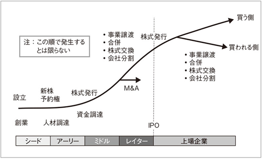
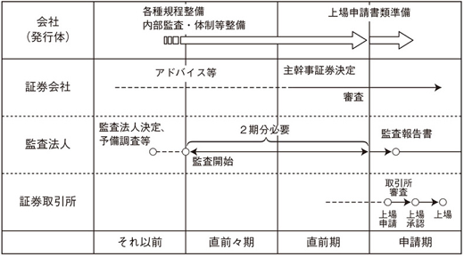
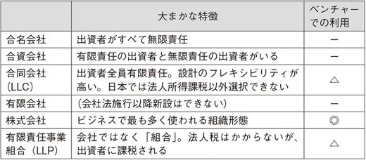
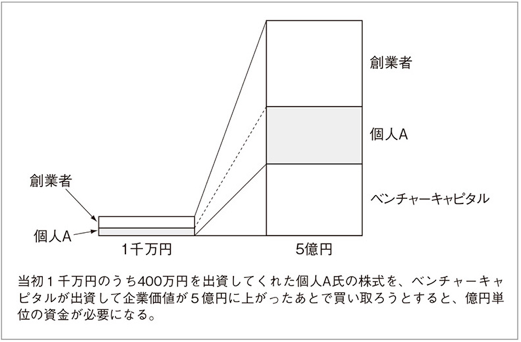
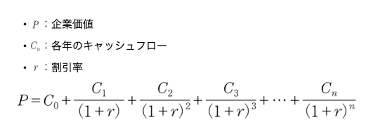

# 起業のファイナンス

磯崎哲也

---

## なぜ今「ベンチャー」なのか？

- 不況時に堅めに考えて商売を始めた方が成功率が上がる、ライバルも少ない
- 資金調達がいらない起業が増えている
- ビジネスにはスピードが重要
- 競争が厳しいビジネスほど、円滑にコミュニケーションできるオフラインが重要
- リスク＝悪ではない、リスクととらないリスクもある
- 将来が見込めそうなら投資される。投資されないのならイケてないを疑え

---

## ベンチャーファイナンスの全体像

- 銀行からの借入ではなく株式での資金調達が中心
- 資金だけが流れ込むとバブルが発生する
- 優先株式でバブル時のダウンサイドリスクを小さくする
- ベンチャーはお金を借りるべきではない
- 収入が不安定な中で毎月元利を返済しないといけないのは厳しい

---

### 投資家は何を求めているか？

- リスクを背負う分、リターンを求める
- 株式には議決権がある（口出しされる）
- 投資契約を締結した場合、議決権を持ってなくても条項が盛り込まれる場合もある
- 成功させるためにフォローしてくれる場合もある
- 投資家との相性は重要

---

### キャピタルゲインの生み出し方（ベンチャー側の目標）

- 上場
- M&A
  - M&A する側の目的は「時間を買う」「イノベーションのジレンマ」を乗り越える

---

### ベンチャーのライフサイクル

- VC のファンドは通常 7~10 年の期間を設定する

---

### 上場に関わるプレイヤー

- 監査法人
  - 上場の 2 年以上前から会計監査をする必要がある
- 証券会社
- 証券取引所
- 証券代行会社（信託銀行など）
- 証券印刷会社
- 弁護士

---

---

### 上場時のチェック

- ビジネスモデル
- 財務諸表
- コーポレートガバナンス
- 法令・規則遵守、反社チェック

---

### 上場のメリット・デメリット

- 内部統制による経営の硬直化、成長抑止
- 短期的な利益追求によるダイナミズムの損失
- 上場によるブランディング、資金調達
- Google, Facebook は数兆円の規模になるまで上場しなかった
- 事業がイケていて、成長力があることが重要

---

### 会社が潰れることは悪か？

- 企業の終焉は次の会社の始まり
- 成長が見込めない、息も絶え絶えな会社を残すことが重要か？
- 会社が死んでもファイナンスの選択肢を謝らなければ次のビジネスの取り組める
- 成功しなかったことは「失敗」ではない。「経験」という価値がある

---

### ベンチャーへの投資

- 日本：718 億（2013 年度）
- 米国：42,541 百万ドル（2013 年度)
- 日本のベンチャーは売り手市場（シリコンバレーのようにチャレンジ数が多くない）

---

## 会社の始め方

- 法人は人工的な人格
- 法人には公私の区別がある
- アニマルスピリッツ
- 成功は 3 割、失敗は 7 割
- 強烈な願望が止めようもなく心の底から湧き上がってくるタイプ：起業向き
- 理性的に物事を分析する方が好きなタイプ：起業は向かないかもしれない
- リーダーでなくても起業に関わる方法はある

---

### 個人経営と会社

- 株式で資金調達する場合は会社である必要がある
- 会社には事務コストがかかる
- 個人事業主の総合課税と会社の法人税
- 会社は有限責任（倒産しても会社の責任だけを債権者に払う）
  - 銀行借入だと社長が個人保証させられるのが一般的
- 個人事業主は無限責任（現実的に個人事業で有限責任を活かせるケースは稀）
- 説明コスト（合同会社、有限責任事業組合って何？）
- 信用（ただ、資本金がなくても作れるので株式会社だから信用できるわけではない）

---

---

### 事業価値評価と法人化のタイミング

- 増資を受ける半年程度前に会社にする方が良い
- 個人で行ってきた事業を法人化する場合
  - 創業者個人から法人への事業譲渡
  - 現物出資（事業を出資して法人が株式を発行）

---

### 税務と法人化のタイミング

- 個人が法人に譲渡したタイミングで、お金をもらってなくても時価で譲渡したことになる
- 創業者と法人は別人格
- 赤字か利益が出ていない段階かつ、VC との増資交渉が始まっていない段階が望ましい

---

### 資本金

- 資本金は債権者が資金を回収しやすくするためのバッファ
- 資本金が大きいほどえらい＝銀行（債権者）中心社会のマインド
- ベンチャーは「株主」中心の世界
- 登録免許税も資本金に比例
- 消費税や法人税も資本金が少ない方が有利
- ベンチャー設立時はなるべく資本金を減らせないかを考える
- 会社を設立すると諸費用で数十万はかかるの
  - 債務超過になる資本金 1 円などはお勧めできない

---

### 現物出資の活用

- 会社法第 33 条
- 500 万以下であれば発起人や取締役だけの責任（検査役なし）で現物出資できる
- 将来の監査、デューデリには注意
  - 価格算定根拠を証拠として残しておく
  - 可能であれば第三者の算定書を取得しておく

---

### 「エンジェル」の性質と問題点

- 創業者と投資家が普通株式で同時に出資する場合、持分比率を意識すべき
- 創業者の持分が少ない会社はインセンティブが低そうと見られる（上場しにくくなる）
- 天使が悪魔になることもよくある
- シンプルな方法は、外部の投資家の比率を低く、人数もごく少数にする
- 創業期に必要なのは「いいアドバイスを伴うカネ」もしくは「単なるカネ」
- 「足を引っ張るカネ」は不要
- VC からの投資は 3 ヶ月程度の余裕を見ておいた方が良い

---

---

## 事業計画の作り方

- 必要とされるのは「状況に合わせて臨機応変に対処できる能力」
- イケてるベンチャーの要件
  - いけてるソーシャルグラフの中に潜り込んでいる
  - 必要を叶える能力がある
    - 資金を出してくれる人にたどり着く
    - 人材を見つけ出す
    - 営業で成果を上げる
- 人の出会いと同じように、事業との出会いも第一印象が重要
- 成功が明らかなものはほとんどない、だからこそ説得力や将来性が重要

---

### センスだけでは経営は続かない

- 経営者は「経営」「ファイナンス」もわかっていないと長続きしない
- 事業計画は「会社や経営者を縛るもの」ではない、あってはならない

---

### 数値計画（一部）

- 市場規模、顧客数、シェア、単価などの前提条件
- 売上、売上原価
- 広告費・販売促進費
- 人件費、福利厚生費等
- 賃料
- 減価償却費
- その他経費
- 営業外費用や法人税等
- 貸借対照表項目、キャッシュフロー

---

#### 経営は「数字」だけではできない しかし、経営の結果は必ず「数字」になる

---

- 粗くてもいい
- 本当にすごいと思われるベンチャーなら誰かが手伝ってくれる
- 創業者の才能や構想している事業の内容がすごい場合、事業計画がイマイチでも資金は集まる
- いろんな角度から事業計画の想定問答して答えられるか
- 銀行から資金を借り入れるときの事業計画と、ベンチャーの事業計画は大きく異なる

---

## 企業価値とは何か

- 事業価値、企業価値、株主価値
- 事業価値 = 事業用資産 - 負債（買掛金・未払金など）
- 企業価値 = 事業価値 + 事業に使っていない資産
- 株主価値 = 企業価値 - 有利子負債

---

### 帳簿価格と企業価値評価

- 帳簿純資産法（過去を見る評価方法）
- ベンチャーは過去で勝負したら負け、未来の可能性で評価すべき
- 日本の場合、簡単に過半数を他人に渡すことは考えない方が良い
- 類似企業批準、類似業種批準
  - 類似は競合でもある
  - 数値に比例するのか
  - 参考になる数値が入手できるのか
- 未来に注目した企業価値（DCF 法）

---

---

### 未来を確実に予想する方法はない

- VC 1 社に断られても諦めずにいろんな投資家にぶつかってみる
- 1 回の増資で会うべき投資家の数は、数十は普通
- 成長の確実性を高める努力に時間をかけることと旬を逃さないことのバランス
- 企業価値は「需給」で決まる
- 企業価値が安くて得になることはあまりない
- ただし、高ければ高いほど得とも限らない

---

## ストックオプションを活用する
